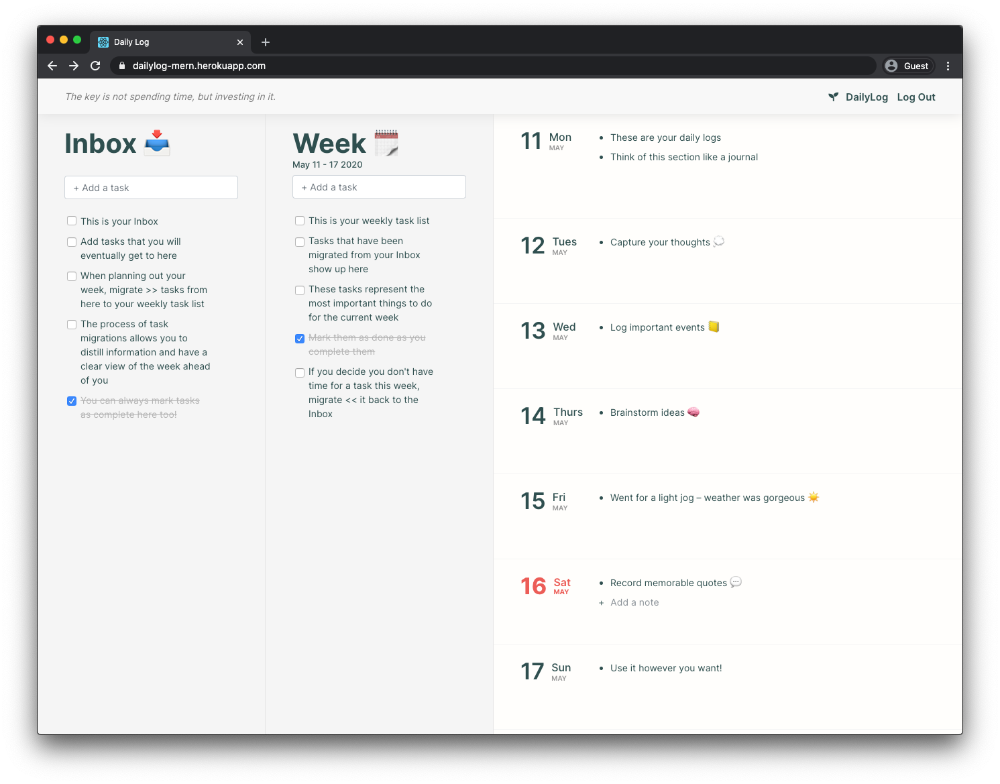
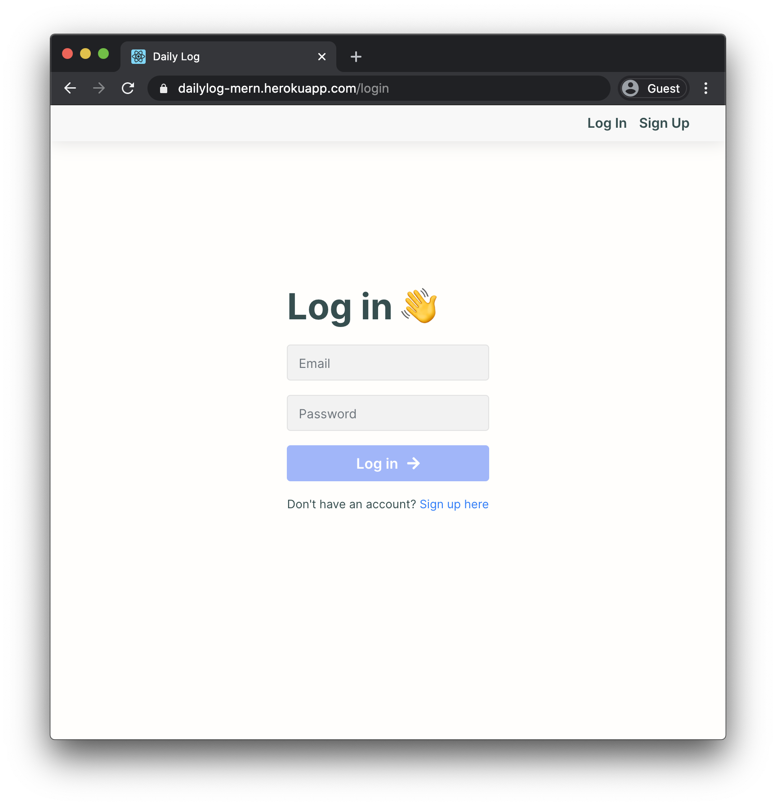

# DailyLog

  
  

### [Create a free account here](https://dailylog-mern.herokuapp.com/login)

**DailyLog** is a note taking and task manager application combined. Use it to *plan for the future and record the past so that every day you can be more present*. Add floating tasks to your Inbox  📥 and when you want to accomplish them within the current week, migrate them to the weekly task list 📅. The Day view on the right provides a space where you can take any notes for a specific day.

### Why did I create this application?

I wanted to create an application that satisfied my needs for a note taking and task manager application combined. There are many options on the market that attempt to acheive this but I wanted to create one that fit my needs perfectly. In particular, I wanted a history of how tasks are migrated between tiers of urgency (ie. moving a task from your Inbox, to your weekly task list, to your daily task list). I believe having a history of this movement is good for mindfulness and self-improvement.

## Built With 👨‍💻
* `MongoDB/Mongoose`
* `Express`
* `React`
* `Node.js`

## Next Steps
* Add ability to add tasks to Day view
* Task migrations between lists
* Autmatic migrations at the end of the week
* Monthly and yearly view navigation
* Colour picker for tasks and notes
* Drag and drop items between components
* Dark mode
* Google Calendar integration

> Follow its development in this [Trello board](https://trello.com/b/ARvGWWjJ)