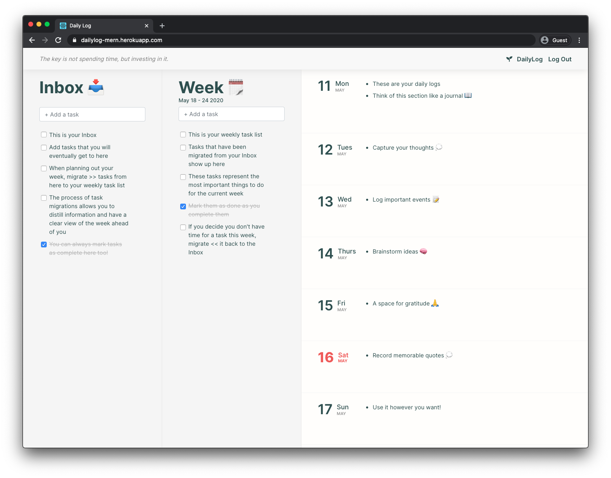

# DailyLog

**DailyLog** is a note taking and task manager application combined. Add floating tasks to your Inbox 📥. When planning out your week, *migrate* tasks from your Inbox >> to your weekly task list 📅. The process of task migrations allows you to distill information and have a clear view of the week ahead of you. The daily log section on the right provides a space where you can take any notes for a specific day. It acts as a brain dump section where you can record anything you want really. This single page application was built using the MERN stack and interfaces with a DailyLog RESTful API.

#### *Plan for the future and record the past so that every day you can be more present*

#### [Create a free account here >>](https://dailylog-mern.herokuapp.com/signup)

  
  
  

  
  

> **NOTE**: User authentication is implemented via JSON Web Tokens and passwords are hashed using the `bcrypt` library

### Why did I create this application?

I wanted to create an application that was both a note taking and task manager application combined. There are a few options on the market that attempt to acheive this but I wanted to create one that was easy to use and understand.

## Built With 👨‍💻

* `MongoDB/Mongoose`
* `Express`
* `React`
* `Node.js`

## Next Steps
* Add ability to add tasks to Day view
* Autmatic migrations at the end of the week
* Monthly and yearly view navigation
* Colour picker for tasks and notes
* Drag and drop items between components
* Dark mode
* Google Calendar integration

> Follow its development in this [Trello board](https://trello.com/b/ARvGWWjJ)
